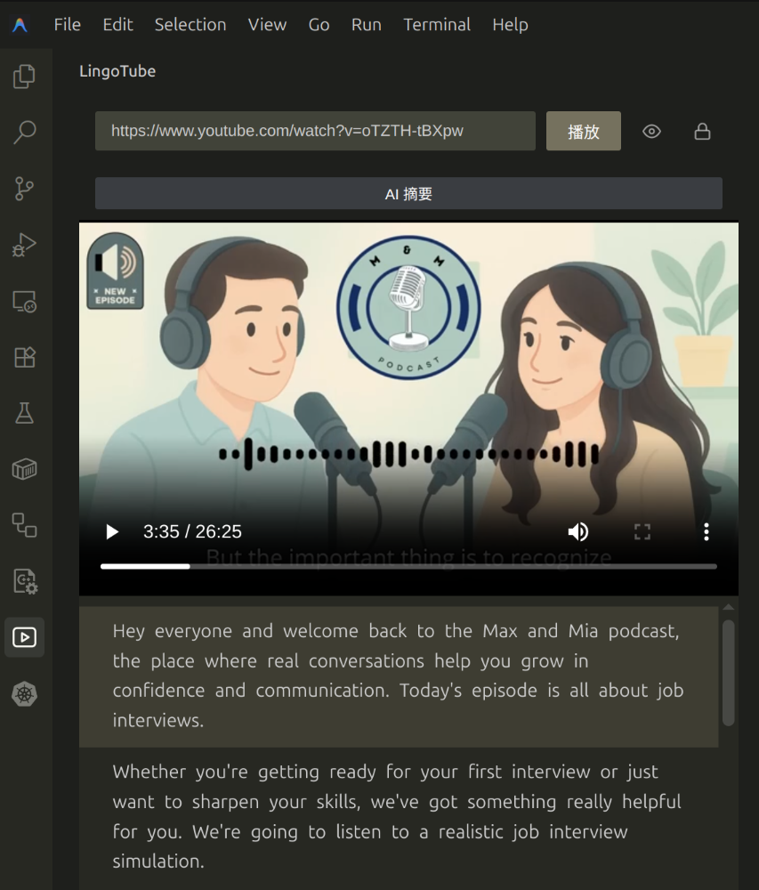
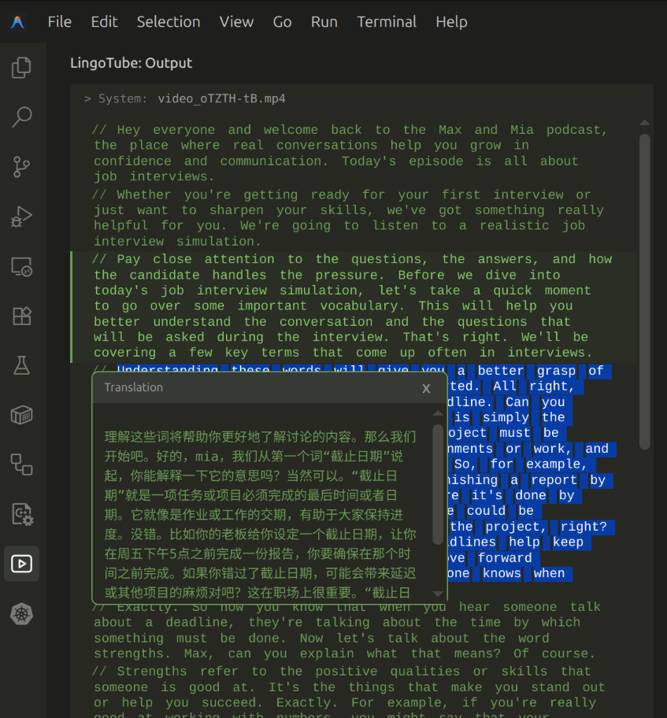

# LingoTube - YouTube English Learning Assistant for VS Code & Forks

[English](README_EN.md) | **中文**

LingoTube 是一款内置于 VS Code 及其 Fork IDE（如 Antigravity、Cursor 等）的 YouTube 英语学习插件。

在等待 AI 代码生成或任务编译的间隙，无需切换至浏览器等外部应用，即可直接在 IDE 侧边栏完成 YouTube 视频精听、词汇查询与语法分析。

### 正常模式 (Normal Mode)


### 伪装模式 (Camouflage Mode)


> **播放兼容性说明**：官方 VS Code 内置的 Chromium 内核未包含 AAC/H.264 专利解码器。本插件优先提取 YouTube 开放编码流（WebM/VP9 视频 + Opus 音频）实现音视频分离同步播放，可在官方 VS Code 中正常出声出画。若极少数视频无开放编码流则会自动回退至 MP4（在内置了解码器的 Cursor、Antigravity 中不受影响）。

## 主要功能

- **IDE 原生播放**：在活动栏或编辑器侧边栏内播放 YouTube 视频，无需跳转浏览器。
- **智能同步字幕**：自动提取并同步滚动显示字幕，基于停顿与标点优化分句体验。
- **即点即译 (Smart Lookup)**：点击字幕中的任意单词，自动通过 AI 查询音标、释义及例句。
- **AI 视频摘要**：一键提取视频核心要点与实用表达，生成学习笔记。
- **语法分析**：对长难句进行句法结构拆解及核心语法点解析。
- **双重隐私防护**：
  - **听力模式 (Listening Mode)**：隐藏视频画面，仅保留音频与字幕。
  - **伪装模式 (Camouflage Mode)**：按快捷键 **Alt+Q** 瞬间将字幕面板转换为 VS Code 代码风格。
- **灵活 AI 配置**：支持 VS Code 内置 AI，或自定义 OpenAI 兼容接口（如 DeepSeek、Ollama 等）。

## 环境依赖

使用本插件前，请确保系统中已安装 [yt-dlp](https://github.com/yt-dlp/yt-dlp)：

- **macOS**: `brew install yt-dlp`
- **Linux**: `sudo curl -L https://github.com/yt-dlp/yt-dlp/releases/latest/download/yt-dlp -o /usr/local/bin/yt-dlp && sudo chmod a+rx /usr/local/bin/yt-dlp`
- **Windows**: `scoop install yt-dlp` 或 `winget install yt-dlp`

## 使用指南

1. **启动插件**：点击活动栏中的 **LingoTube** 图标。
2. **播放视频**：在输入框中粘贴 YouTube 视频链接或 ID，回车即可开始播放。
3. **切换隐私模式**：
   - 点击界面控制按钮切换至**听力模式**（隐藏视频）。
   - 使用快捷键 **`Alt + Q`** 瞬间切换至**伪装模式**（代码化掩护）。
4. **AI 学习辅助**：点击字幕单词即时查词，或点击 **AI 视频摘要** 获取内容要点。

## AI 模型配置

插件默认尝试使用 IDE 内置 AI 接口。如需指定自定义模型，可在 VS Code `settings.json` 中配置：

```json
{
  "lingoTube.ai.apiKey": "your-api-key",
  "lingoTube.ai.baseUrl": "http://localhost:11434/v1",
  "lingoTube.ai.model": "qwen2.5:7b"
}
```

## 更新日志

请参阅 [CHANGELOG.md](./CHANGELOG.md)。

## 开源协议

[MIT License](./LICENSE)