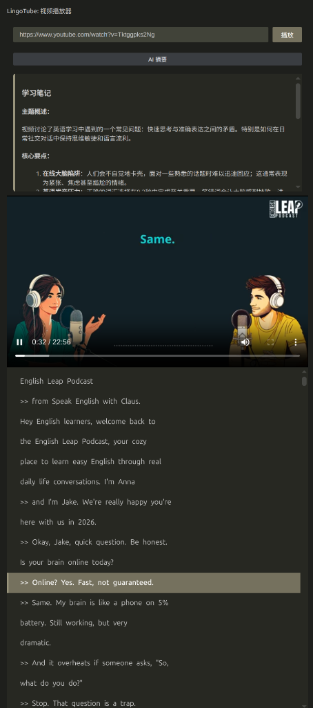

# LingoTube - Antigravity、Cursor 等 VS Code Fork IDEs YouTube 英语学习助手

LingoTube 是一款**专为 Antigravity、Cursor 等 VS Code Fork IDEs 量身打造**的英语精听学习插件。

> **为什么开发这个插件？**
> Vibe Coding 时经常需要等待 AI 输出，这段时间很容易被浪费，不如一起来学习英语吧。但我又不想切换到其他独立的窗口或进程（比如浏览器），所以我开发了这个“摸鱼（学习）”插件！




 **重要说明**：由于原生 VS Code 及其内置 browser 内核缺乏对 **AAC 音频格式** 的解码支持，导致无法直接播放 YouTube 视频流，所以 VS Code 中安装此插件不会有音频。 Antigravity、Cursor 测试通过，其他 forks 未测试。

## 功能特点

- **原生级播放体验** - 在 Antigravity、Cursor 等 IDE 活动栏或编辑器侧边栏直接流畅播放 YouTube 视频。
- **智能同步字幕** - 自动抓取并同步显示双语字幕，支持实时滚动。
- **即点即译 (Smart Lookup)** - 视频播放中，点击字幕中的任意单词，利用 AI 立即提供音标、释义及用法。
- **AI 视频摘要** - 一键提取视频核心内容，自动生成结构清晰的学习笔记。
- **深度语法分析** - 遇到长难句？AI 帮你拆解句子结构，分析核心语法点。
- **AI 模型灵活性** - ~~完美适配 Antigravity 内置语言模型 (需有 AI 订阅)(vscode 是支持的，但是 antigravity 没有开放chat api)~~；同时支持自定义 OpenAI 兼容接口（如 DeepSeek, Ollama 等）。

## 安装环境

在使用本插件前，请确保系统中已安装以下工具：

1. [yt-dlp](https://github.com/yt-dlp/yt-dlp) - 核心组件，用于解析视频流。
  - macOS: `brew install yt-dlp`
  - Linux: `sudo curl -L https://github.com/yt-dlp/yt-dlp/releases/latest/download/yt-dlp -o /usr/local/bin/yt-dlp && sudo chmod a+rx /usr/local/bin/yt-dlp`
  - Windows: `scoop install yt-dlp`

## 使用指南

1. **启动插件**：点击 Antigravity、Cursor 等 IDE 活动栏的 **LingoTube** 图标。
2. **加载视频**：在搜索框输入任意 YouTube 视频链接或 ID，回车即可开始播放。
3. **AI 辅助**：直接点击侧边栏中的 **AI 视频摘要** 或 **语法分析** 按钮获取结果。

## AI 配置自定义

本插件默认尝试使用 Antigravity 内置 AI。若需使用自定义模型（如 Ollama, DeepSeek 等），请在 `settings.json` 中配置：

```json
{
  "lingoTube.ai.apiKey": "您的 API Key (Ollama 可随便填)",
  "lingoTube.ai.baseUrl": "http://localhost:11434/v1", // 以 Ollama 为例
  "lingoTube.ai.model": "qwen2.5:3b"        // 指定模型名称
}
```

---

**LingoTube** - Antigravity、Cursor 等 IDE Vibe Coding 时抽空学习英语的利器。